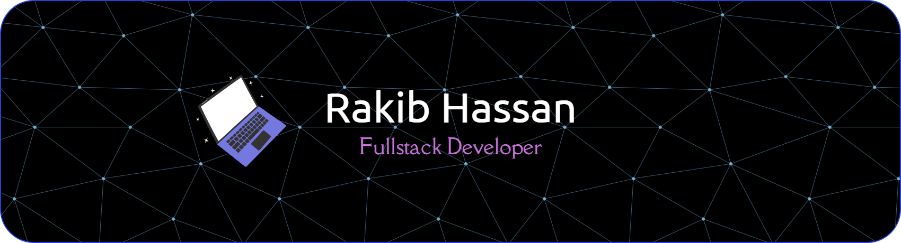

&nbsp;
&nbsp;

### About Me:
Full-Stack Developer
- 👨🏻‍💻 Building modern SaaS and e-commerce apps with Next.js, TypeScript, and Tailwind CSS — clean UI, fast performance, and real impact.
  
- 🔭 Focused on scalability, maintainability, and seamless developer experience..
- ⚡ Always learning, always shipping.

### 📫 Reach me out :

<!-- Border Line -->

<!--Languages and Skills Section--> 

  
  <b>Skills :</b>

#
<!-- Github stats Table  -->

  <g-emoji class="g-emoji" alias="chart_with_upwards_trend" fallback-src="https://github.githubassets.com/images/icons/emoji/unicode/1f4c8.png">📈</g-emoji>
  <strong>GitHub Streak : </strong>

 

 

#

  <g-emoji class="g-emoji" alias="chart_with_upwards_trend" fallback-src="https://github.githubassets.com/images/icons/emoji/unicode/1f4c8.png">📊</g-emoji>
  <strong>Github Stats : </strong>

 

     

#
<!-- Dev Stats -->

  <g-emoji class="g-emoji" alias="chart_with_upwards_trend" fallback-src="https://github.githubassets.com/images/icons/emoji/unicode/1f4c8.png">📊</g-emoji>
  <strong>Dev Stats : </strong>

 

⭐️ Starring & Sharing the project is also appreciated. Thanks! ❤️

 
<!--Contribution Graph-->

  <g-emoji class="g-emoji" alias="chart_with_upwards_trend" fallback-src="https://github.githubassets.com/images/icons/emoji/unicode/1f4c8.png">📈</g-emoji>
  <strong>Contribution Graph : </strong>

 

    

<!--Footer--> 

